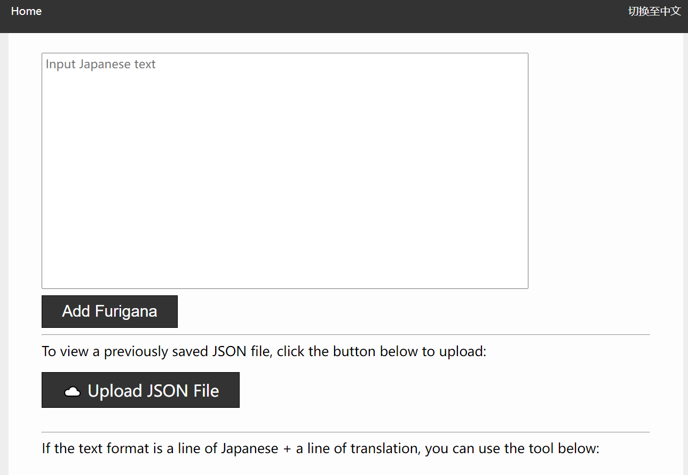
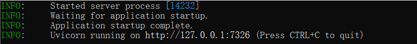
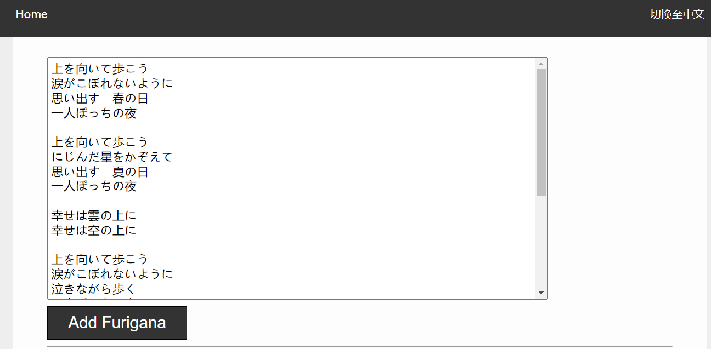
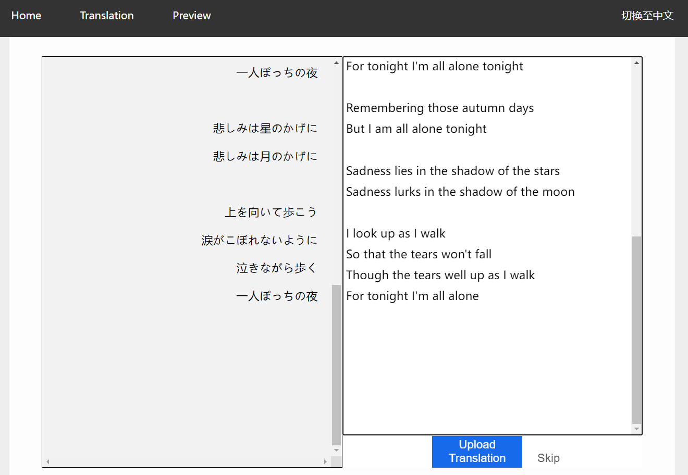
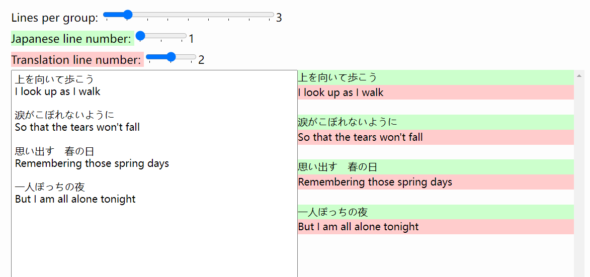
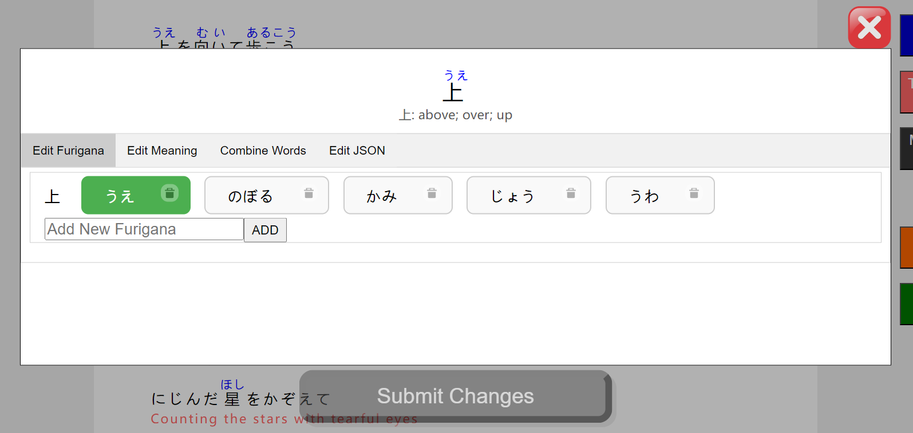
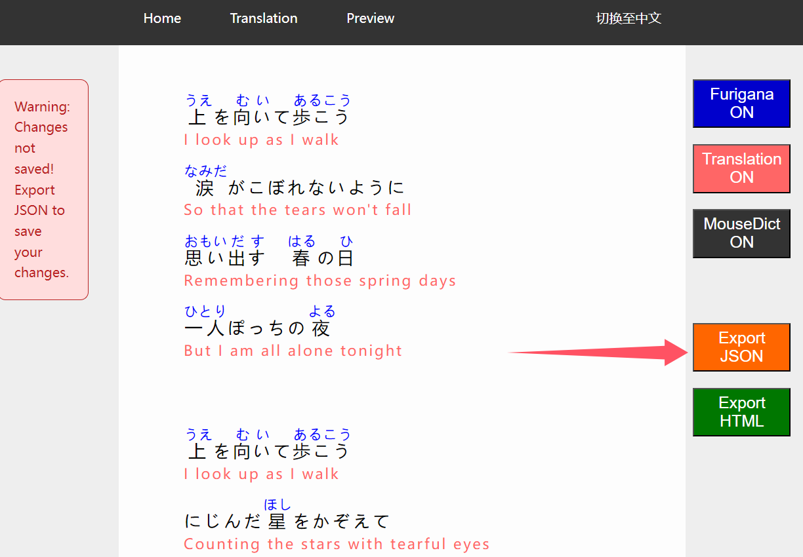
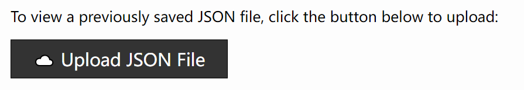

# Furigana Lyrics Designer

[中文](https://github.com/JackNoire/FuriganaLyricsDesigner/blob/master/README.md)|**English**

Furigana Lyrics Designer is a tool for adding furigana annotations to Japanese text. The tool can automatically generate furigana annotations and word definitions for Japanese text. Users can also manually modify incorrect annotations and definitions and save the results locally.

This tool is mainly suitable for Japanese lyrics but can also handle other Japanese texts.

Demo webpage (does not support furigana annotation; only supports uploading JSON files):

https://jacknoire.github.io/FuriganaLyricsDesigner/

## How to Run

The simplest way to run is to download the Windows portable ZIP package:

https://github.com/JackNoire/FuriganaLyricsDesigner/releases/download/202409/FuriganaLyricsDesigner-portable-202409.zip

After extracting, double-click `Furigana Lyrics Designer.exe`.

If it runs correctly, the program will open the default browser and access http://127.0.0.1:7326



The command prompt interface will display the following output:



## How to Use

1. Input Japanese text and click "Add Furigana". Then, in the "Translation" page, upload the translation, ensuring that the original text and translation correspond line by line.





2. If the text format is a line of Japanese + a line of translation, you can use the tool at the bottom of the page to upload both at one time.



3. In the "Preview" page, click on a word to edit its annotation, definition, etc.



4. Click "Export JSON" on the right side of the page to save the modified results to a JSON file.



5. When you reopen the tool, you can click the "Upload JSON file" button to open the previously saved JSON file.



## How to Run (Command Line)

First, ensure that Node.js and npm are installed.

cd `vue-project` and build the frontend:

```
cd vue-project
npm install
npm run build
```

The above commands will generate a `static` folder under the `backend` directory.

Then, cd `backend` and run `run_server.py`:

```
cd backend
pip install -r requirements.txt
python run_server.py
```

## Creating a Windows Portable ZIP package

Download the Python 3.11.5 Windows embeddable package (64-bit):

https://www.python.org/ftp/python/3.11.5/python-3.11.5-embed-amd64.zip

After extracting, rename the folder to `python311` and place it in the backend folder:

```
backend
|   .gitignore
|   app.py
|   JMdict_e.json
|   JMdict_json.py
|   Kana.py
|   run_server.py
|   string_processing_utils.py
|
+---python311
|       libcrypto-3.dll
|       libffi-8.dll
|       libssl-3.dll
|       LICENSE.txt
|       pyexpat.pyd
...
```

Download `get-pip.py`:

https://pip.pypa.io/en/stable/installation/#get-pip-py

Place `get-pip.py` in the `python311` folder, then `cd python311` in the command line and run:

```
python get-pip.py
```

Edit `python311._pth` and add a line for `Lib\site-packages` and a line for `..`:

```
python311.zip
.
Lib\site-packages
..

# Uncomment to run site.main() automatically
#import site

```

Then, use pip to install the required third-party libraries:

```
python -m pip install -r ..\requirements.txt
```

Finally, package the files under `backend` into a ZIP file. The following files do not need to be included:

```
__pycache__
.gitignore
requirements.txt
```

## Credits

[WorksApplications/sudachi.rs: Sudachi in Rust 🦀 and new generation of SudachiPy](https://github.com/WorksApplications/sudachi.rs)

[JMdict-EDICT Dictionary Project - EDRDG Wiki](https://www.edrdg.org/wiki/index.php/JMdict-EDICT_Dictionary_Project)