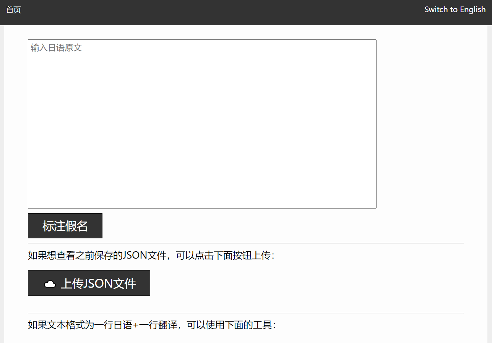
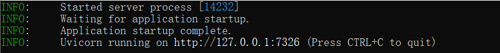
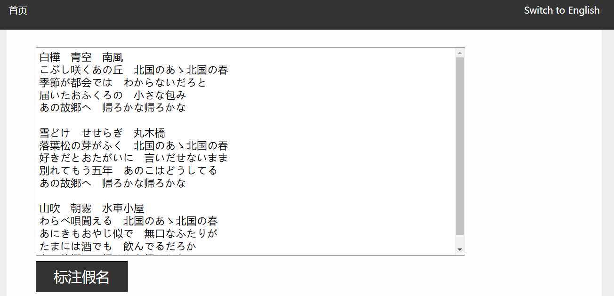
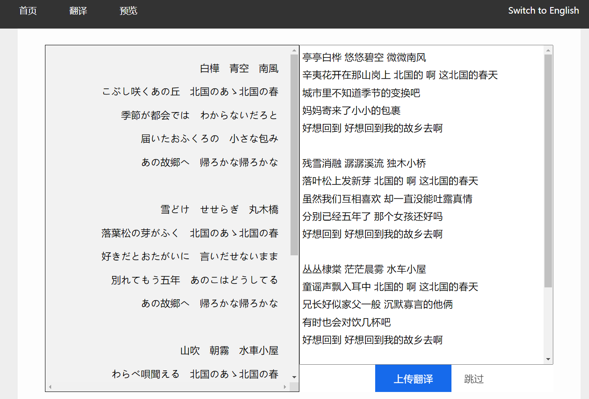
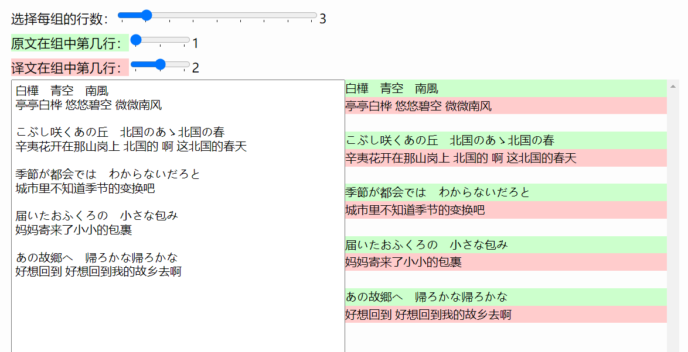
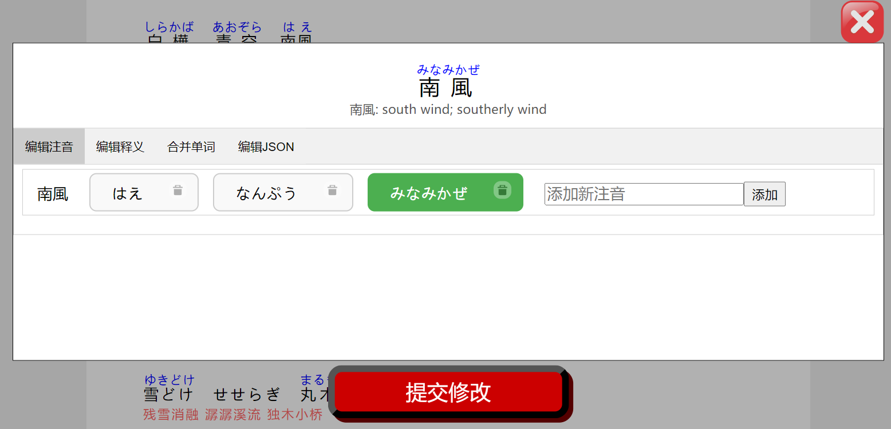
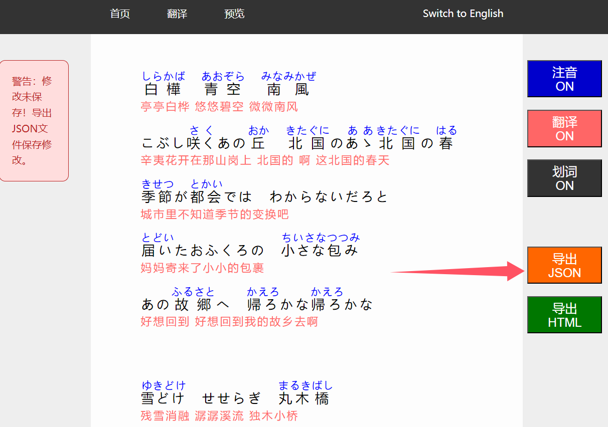
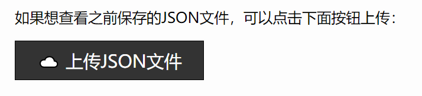

# Furigana Lyrics Designer

**中文**|[English](https://github.com/JackNoire/FuriganaLyricsDesigner/blob/master/README-en.md)

Furigana Lyrics Designer是一个日语假名注音工具。用户输入日语文本后，工具会自动生成假名注音与单词释义。此外，用户还可以手动修改不正确的注音和释义，并将注音结果保存在本地。

本工具主要适用于日语歌词，但同样适合处理其他日语文本。

示例网页（不支持标注假名，仅支持上传JSON文件）：

https://jacknoire.github.io/FuriganaLyricsDesigner/

## 运行方法

最简单的运行方法是直接下载Windows免安装压缩包：

https://github.com/JackNoire/FuriganaLyricsDesigner/releases/download/202409/FuriganaLyricsDesigner-portable-202409.zip

解压后双击Furigana Lyrics Designer.exe。

如果正常运行，程序会打开默认浏览器，访问http://127.0.0.1:7326



程序的命令提示符界面会有以下输出：



## 使用方法

1. 输入日语原文，然后点击“标注假名”；然后，在“翻译”界面，上传翻译，注意原文与翻译需逐行对应





2. 如果文本格式为一行日语+一行翻译，可以使用页面下方的工具同时上传日语和翻译



3. 在“预览”界面，点击单词，即可编辑单词的注音、释义等内容



4. 点击界面右侧的“导出JSON”，将修改结果保存至JSON文件中



5. 之后重新打开工具时，可以点击页面下方的“上传JSON文件”按钮，打开之前保存的JSON文件



## 命令行运行方法

首先确认已安装好Node.js和npm。

进入vue-project，构建前端：

```
cd vue-project
npm install
npm run build
```

上述命令会在backend文件夹下生成static文件夹。

然后，进入backend，运行run_server.py即可：

```
cd backend
pip install -r requirements.txt
python run_server.py
```

## Windows免安装压缩包制作方法

下载Python 3.11.5 Windows embeddable package (64-bit)：

https://www.python.org/ftp/python/3.11.5/python-3.11.5-embed-amd64.zip

解压后，将文件夹重命名为python311，然后放入backend文件夹：

```
backend
|   .gitignore
|   app.py
|   JMdict_e.json
|   JMdict_json.py
|   Kana.py
|   run_server.py
|   string_processing_utils.py
|
+---python311
|       libcrypto-3.dll
|       libffi-8.dll
|       libssl-3.dll
|       LICENSE.txt
|       pyexpat.pyd
...
```

下载get-pip.py：

https://pip.pypa.io/en/stable/installation/#get-pip-py

将get-pip.py放到python311文件夹下，然后命令行进入python311文件夹，运行：

```
python get-pip.py
```

编辑python311._pth，添加一行`Lib\site-packages`和一行`..`

```
python311.zip
.
Lib\site-packages
..

# Uncomment to run site.main() automatically
#import site

```

然后用pip安装需要的第三方库：

```
python -m pip install -r ..\requirements.txt
```

最后，将backend下的文件打包成zip即可。下面这些文件不用打包：

```
__pycache__
.gitignore
requirements.txt
```

## 致谢

[WorksApplications/sudachi.rs: Sudachi in Rust 🦀 and new generation of SudachiPy](https://github.com/WorksApplications/sudachi.rs)

[JMdict-EDICT Dictionary Project - EDRDG Wiki](https://www.edrdg.org/wiki/index.php/JMdict-EDICT_Dictionary_Project)
